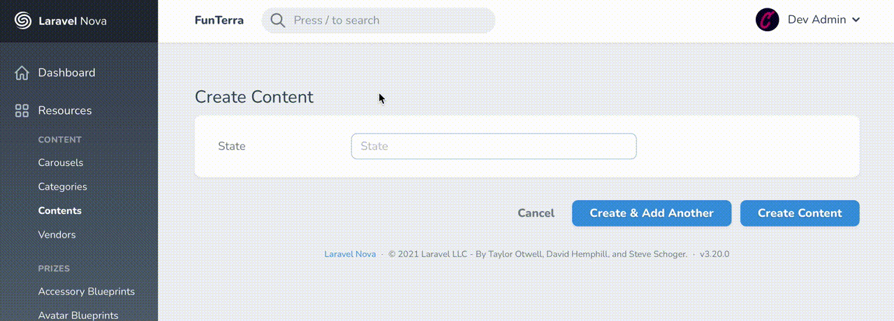

# laravel-nova-text-auto-complete
A Laravel Nova text field supporting autocomplete from an array of values. The field is a simple text field with the ability to provide autocompletion from an array of strings.

This does not force the selection of an item. The user will be free to type arbitrary text.

## Demo



## Installation

From the command line:

```bash
composer require lhilton/text-auto-complete
```

## Usage

Provile an array of strings that you want to be shown during usage.

```php
use Lhilton\TextAutoComplete\TextAutoComplete;

public function fields(Request $request)
{
    return [
        TextAutoComplete::make('Regions')->items([
            'Alabama',
            'Alaska',
            'Arizona',
            'Arkansas',
            // ...
            'West Virginia',
            'Wisconsin',
            'Wyoming'
        ]),
    ];
}
```

You can feed from an Eloquent model like this:

```php
use App\Models\User;
use Lhilton\TextAutoComplete\TextAutoComplete;

public function fields(Request $request)
{
    return [
        TextAutoComplete::make('Regions')->items(
            User::select('title')
                ->distinct()
                ->get()
                ->pluck('title')
                ->filter()
                ->values()
                ->toArray();
        ),
    ];
}
```
